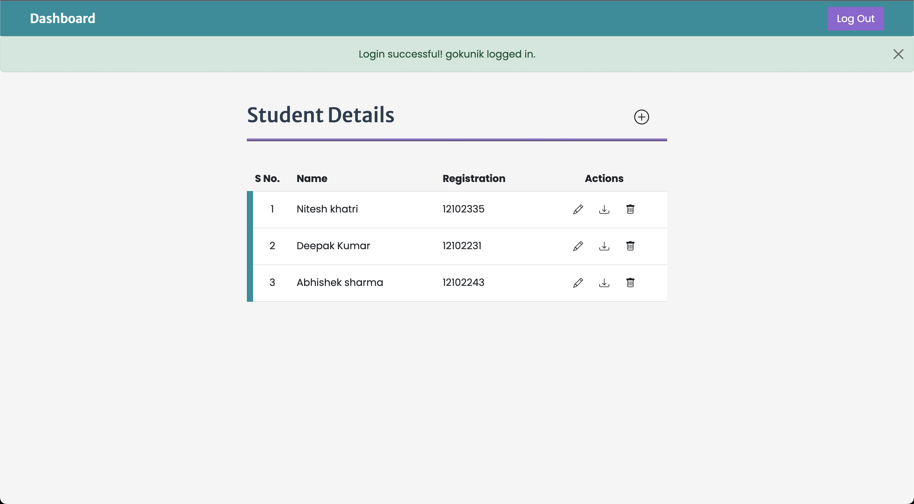

# Student ID Card generator

 &nbsp;
 &nbsp;
 &nbsp; 
 &nbsp;
 &nbsp;
 &nbsp;

A php crud application to generate student ID card. The application is integerated with mysql for database functionality.

Live link: <a href="https://student-id-generator.epizy.com/" target="_blank"> Student ID card Generator </a>  (best viewed on desktop broswer)

### Setup and config info

- You need to have XAMPP installed on your system with apache server and mysql running.

- Place the project inside the "XAMPP > htdocs" folder.

- Create a database (In my case it's name is ca3) and config the database by importing the "databaseConfig.sql" file using the import option in the top menu bar. It will create base schema for the project.

- Setup database connection by providing right credentials(server name, username, password, databasename) in the "database/connection.php" file.

- Database schema  
    ca3 (database)   
    |----- userTable: 4 column (id,username,password,created)  
    |----- studentsDetails: 11 column (id,firstName, $lastName, regNo, email, mobile, dob, courseStart, courseEnd, image, address)

### Project functionality

- Log in and Log out functionality
- Add, edit, select, remove and download students details

#### Screen Shots

#### Login

#### Dashboard

#### Add Student Details

#### Edit Student Details

#### Download Student ID Card

